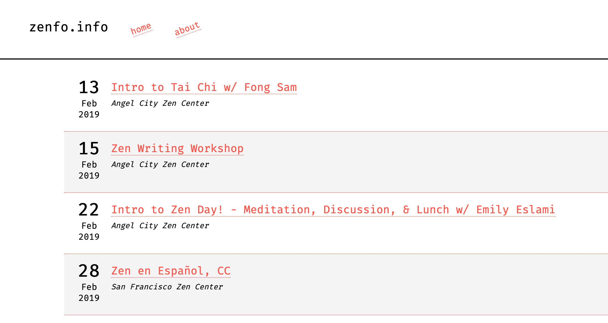

# zenfo.info

# About

Zen retreats sound fun, right? But how do you get involved? When is a retreat happening nearby? Is the retreat beginner friendly?

All of these questions (and more!) is what zenfo.info aims to answer. Unless you're actively involved in a community, it may be difficult to learn
of new events going on near your area. Even if you are involved in a community, the events you hear of in person are usually just related
to that specific group.

What if you're traveling, and wish to attend a short retreat? Many Zen centers have websites, and some list events on a calendar page. However, some groups only notify of events in person or mailing list. Zen groups are typically low budget, and usually not too tech savvy. This is where zenfo.info comes in - simply visit the site to see a compiled list of events going on around the world.

# Nitty Gritty

There are three main pices:

1. Crawlers

The crawlers gather event information from a list of specific websites. Any information found is stored into Postgres.

2. HTTP API

A web server provides API endpoints to retreive event information.

3. UI

React frontend calls API to provide something useable on the browser.

## Sources

So far there are two sources:

1. San Francisco Zen Center (sfzc.org)
2. Angel City Zen Center (aczc.org)

Sources are scraped by using the `Worker` interface. All workers share a common HTTP client which provides a custom user agent. And in the future there will need to be rate limiting per site.

## Milestones for 1.0 release

1. Add at least two more sources for crawling. Ideally one from East Bay, and one South Bay.
2. Add basic frontend UI, ideally something in JS.
3. Add some sort of detection on when a crawler is completely busted and needs updating.
4. Add Dockerfile for easy deploy.

## Build database and backend API

`make docker`

`make setup`

`make build`

`make db`

`make http-dev`

## Run frontend

I do this outside of Docker.

`npm install`

`npm run start`

## License

Currently this project is licensed under AGPL v3.0. See `LICENSE` for details.

I'm usually not a fan of anything GPL, but with this project it feels right. License may change in the future to something more permissive.
